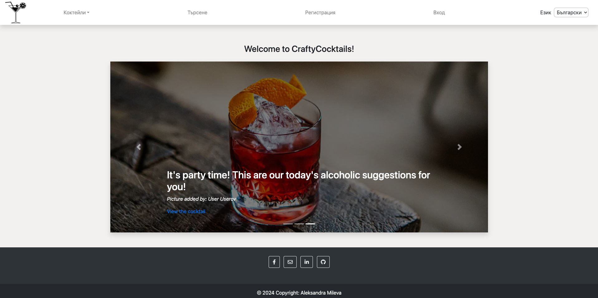

# Crafty Cocktails blog

**Depends on [Drinking Fortunes REST API - please check it](https://github.com/aleksandra-mileva/DrinkingFortunesRestApi)**

This project is a blog about cocktails. It is a place where users can find cocktails for different cocktails, share their own cocktails, comment on the cocktails of other users, save their favourite cocktails.

##  How to run with Docker
- Use docker compose to run the application. The application will be available on `http://localhost:8080/`.
- The docker compose file is in the root of the project and contains images for the application, the database and the Drinking Fortunes REST API.
- Following command should be executed in /local directory of the project with already installed docker and docker-compose: `docker-compose up` or `docker-compose -f docker-compose-amd.yaml up`
- You can log in with the following credentials: 
  - **Admin**: username: `admin`, password: `12345`
  - **User**: username: `user`, password: `12345`
##  Built with
- Java 17
- Spring Boot
- Spring Security
- Spring Data JPA
- Thymeleaf Template Engine
- MySQL
- JavaScript
- Bootstrap
- Apache Maven
- Mockito
- Model Mapper
- Validation and Error Handling
- Interceptors 
- Internationalization (i18n)
- Schedulers
- Cloudinary
- CriteriaBuilder API
- **Docker**

##  Functionality
**For all users**
- List all cocktails: `/cocktails/all`
- List cocktails by spirit: `/cocktails/whiskey`, `/cocktails/vodka`, `/cocktails/rum`, `/cocktails/gin`, `/cocktails/tequila`, `/cocktails/brandy`
- View single cocktail details (by id): `/cocktails/details/{id}`
- Search cocktails by criteria: `/cocktails/search`

**For not authenticated users**
- Register and verify the profile by a verification token sent to the email: `/users/register`
- Requesting a new mail with verification token in case the first one was deleted. This
  request is allowed only for users with not verified profiles: `/users/register/sendNewVerificationMail?username=`
- Reset forgotten password via secure token send to email: `/password/reset`
- Login only for verified profiles: `/users/login`

**For authenticated users**
- Add cocktail: `/cocktails/add`
- Update cocktail allowed only for the owner of the cocktail and the admin: `/cocktails/edit/{id}`
- Delete cocktail (by id) allowed only for the owner of the cocktail and the admin: `/cocktails/delete/{id}`
- Upload picture for a cocktail allowed for all authenticated users: `/cocktails/details/{id}/picture/add`
- Delete picture allowed for the owner of the picture and the admin: `/cocktails/details/{cocktailId}/picture/delete?pictureId=`
- Add or remove a cocktail from favorite cocktails (REST): `/api/cocktails/{id}/addOrRemoveFromFavorites`
- View posted comments for a cocktail: `/api/{cocktailId}/comments`
- Post comments for a cocktail: `/api/{cocktailId}/comments`
- Delete a comment allowed only for the owner of the comment and the admin: `/api/{cocktailId}/comments/{commentId}`
- View profile details: `"/users/profile/{id}`
- Edit profile details: `/users/profile/{id}/editProfile`
- List all cocktails uploaded by a user, allowed only for the user: `/users/profile/{id}/addedCocktails`
- List all pictures uploaded by a user, allowed only for the user: `/users/profile/{id}/addedPictures`
- List users favourite cocktails, allowed only for the user: `/users/profile/{id}/favoriteCocktails`
- Delete a picture added by user, allowed only for the user (by userId and pictureId): `/users/{id}/deletePicture?pictureId=`
- Get random fortune from **Drinking Fortunes REST API**: `/fortunes/fortune`

**For admins**
- View number of registered users, all uploaded cocktails, number of cocktails by spirit: `/statistics`
- Get all fortunes from **Drinking Fortunes REST API**: `/fortunes`
- Delete a fortune (**Drinking Fortunes REST API**): `/fortunes/{id}`
- Add a fortune (**Drinking Fortunes REST API**): `/fortunes/add`

**Common**
- Maintenance of the blog (**Maintenance interceptor**) - The interceptor checks the current time and if it is between 22:59 and 23:59, redirects to `/maintenance`
- Scheduler for sending Report to the admins every day at 00:00
- Scheduler for changing the home page two times a day at 00:00 and 16:00
- Scheduler for cleaning the database from unverified users and expired tokens every 16 minutes

##  Bonuses
- Drinking Fortunes REST API - **a separate project** that provides funny drinking fortunes. Using **WebClient** to communicate with the REST API.
- **Cloudinary** - for uploading pictures
- **Docker** images and docker-compose file for running the application
- **Liquibase** for the database of Drinking Fortunes REST API
- **MapStruct** in Drinking Fortunes REST API (ModelMapper in this project)
- Website is **Responsive**

